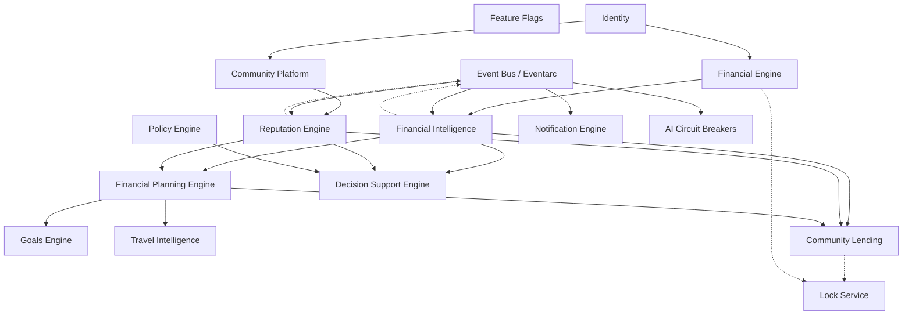

# Service Dependency Graph

This graph illustrates the layered, deterministic architecture of the ONE backend. Circular dependencies are strictly forbidden.

```mermaid
graph TD
    %% Core Infrastructure
    EventBus[Event Bus / Eventarc]
    Policy[Policy Engine]
    Flags[Feature Flags]
    Lock[Lock Service]
    Auth[Identity]
    
    %% Base Data Layers
    Financial[Financial Engine]
    Community[Community Platform]
    
    %% Intelligence Layers
    Intel[Financial Intelligence]
    Rep[Reputation Engine]
    
    %% Decision & Planning Layers
    Plan[Financial Planning Engine]
    Goals[Goals Engine]
    Travel[Travel Intelligence]
    Lend[Community Lending]
    
    %% Orchestration & Output
    DS[Decision Support Engine]
    Notif[Notification Engine]
    AI[AI Circuit Breakers]

    %% Infrastructure Dependencies
    Lend -.-> Lock
    Financial -.-> Lock
    Rep -.-> EventBus
    Intel -.-> EventBus
    
    %% Logical Flow
    Auth --> Financial
    Auth --> Community
    
    Financial --> Intel
    Community --> Rep
    
    Intel --> Plan
    Rep --> Plan
    
    Plan --> Goals
    Plan --> Travel
    
    Intel --> Lend
    Rep --> Lend
    Plan --> Lend
    
    Intel --> DS
    Rep --> DS
    Policy --> DS
    
    EventBus --> Notif
    EventBus --> AI
    EventBus --> Rep
    EventBus --> Intel
```
